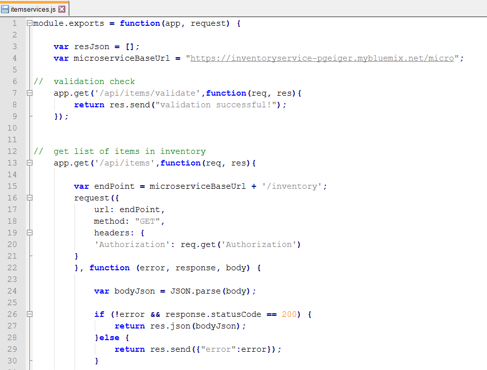

In this unit, you are working with the inventory Backend for Frontend (BFF) application that acts as a proxy for the actual inventory microservice.
The BFF is typically implemented as a placeholder before the actual back-end application is ready and used to validate the front end application.
Over time when the backend application is ready this can be used as a service proxy or another abstraction layer.
The steps here are based on `https://github.com/ibm-cloud-architecture/refarch-cloudnative-bff-inventory`.

*Expected outcome:* You are able to access the inventory information through the BFF app.



The application is built on node.JS. Follow these instructions to evaluate and deploy the BFF, which is a cloud foundry application. The deployment process for a cloud foundry application follows the following process:



## Exercise 1: Exploring the BFF application

 

1. First, let's evaluate how the BFF behaves. The main module resides in the `inventory/routes/itemservices.js` file. This file also defines the route to the inventory microservice. Update the microserviceBaseUrl to the route to your inventory microservice, i.e. inventoryservice-pgeiger.mybluemix.net/micro.


        var microserviceBaseUrl = "http://inventoryservice-<suffix>.mybluemix.net/micro";

    The content of app.<METHOD> calls defines the processing of HTTP operations for the specified path and the function defines the processing it performs.

2. Check the content of `public` path; the files under this directory are available unmapped for HTTP protocol. What files are in this path? _______________________


## Exercise 2: Deploy the application to Bluemix
 

 Because you have already viewed and modified the application, deploying it is easy.

1. Log in to your Bluemix environment
		  # cf login https://api.ng.bluemix.net
 Enter your Bluemix credentials when prompted and select the org and space that you are deploying to if you have more than one.

 

2. The Bluemix application definition resides in `inventory/manifest.yml`. The important definitions that must be customized in this file are:
   - **name**: application name - `inventory-bff-app-<suffix>`
   - **host**: application route hostname - `inventory-bff-app-<suffix>`
   - **services**: attached autoscale service - `cloudnative-autoscale-<suffix>`
 

 

2. In the application directory, run the command:

         # cd refarch-cloudnative-bff-inventory
         # cd inventory
         # cf push
3. Did the application deploy correctly? If not, why not?

## Exercise 3: Troubleshoot deployment problems



1. It seems we missed an important step in preparing the environment, and the error message told us exactly what we need to do in order to corrct the problem.  The manifest.yml file indicated that this application uses the autoscale service, so you first need to create the autoscale service:

         # cf create-service Auto-Scaling free cloudnative-autoscale-${SUFFIX}
2. Re-deploy the application

		# cf push

2. Once the deployment is complete, test the BFF application, use the information from itemservices.js to get some information and verify the setup. Open a Web browser and use the following URLs:
 - `http://inventory-bff-app-<suffix>.mybluemix.net/api/items/validate`

 

   - `http://inventory-bff-app-<suffix>.mybluemix.net/api/items/13401`

 

 - `http://inventory-bff-app-<suffix>.mybluemix.net/api/image/collator.jpg`

 

## Exercise 4: Create a fix for the application

In the BFF application, if you mistype the inventory ID, the application crashes.
It would be desirable to make the application more resilent. To do this, you must discover the reason for the failure.

1. Try to create the failure by querying for an item that does not exist, 1340 in this example. First try it directly from the microservice url: `http://inventoryservice-<suffix>.mybluemix.net/micro/inventory/1340`.
You will notice that it returns an empty result.

2. Now try the same thing through the BFF: `http://inventory-bff-app-<suffix>.mybluemix.net/api/items/1340`. You will get a Bad     gateway error.
 

3. Login to bluemix.net and find the inventory-bff-app-<suffix/> in the Cloud Foundry section of the dashboard.  Click the app name to open the overview and click Logs to view the logs.

4. For log type, click Errors. You see the error information in the log.

  

5. The highlighted line shows the error location (line, column).

6. If you prefer to use the command line, the logs can be viewed from the command line as well. From a command window enter the following:
                # cf logs inventory-bff-app-<suffix> --recent
 

 You would probably want to pipe the output to a file for better viewing as shown in the example.

7. Now let's go fix the problem. Open the `routes/itemservices.js` and look at the line indicated by the failure.
You can see that the error happens because it is trying to parse a JSON string, but because there was no match for the item number, the string is empty.

The empty string result that you saw when you used the microservice API is actually the source the problem, so a simple solution is to add the following code before the parse:

         . . .
         if (0 === body.length) {
            body = "{}";
         }
         var bodyJson = JSON.parse(body);
         . . .

5. Save the itemservices.js and republish the application.

        # cf push

2.  Test the solution. Enter the following url in your browser: `http://inventory-bff-app-<suffix>.mybluemix.net/api/items/1340`. The result should now be an empty JSON object `{}` instead of the crash.

  
