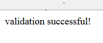
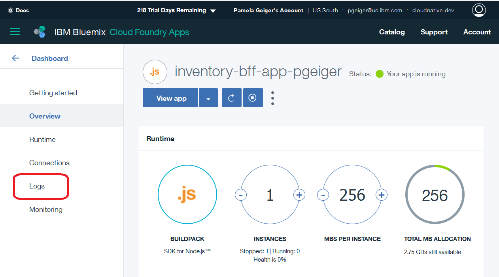

In this unit, you are working with the inventory Backend for Frontend (BFF) application that acts as a proxy for the actual inventory microservice. 
The BFF is typically implemented as a placeholder before the actual back-end application is ready and used to validate the front end application. 
Overtime when the backend application is ready this can be used as a service proxy or another abstraction layer. 
The steps here are based on `https://github.com/ibm-cloud-architecture/refarch-cloudnative-bff-inventory`.

*Expected outcome:* You are able to access the inventory information through the BFF app. 



The application is built on node.JS. Follow these instructions to evaluate and deploy the BFF, which is a cloud foundry application. The deployment process for a cloud foundry application follows the following process:



## Exercise 1: Exploring the BFF application 


1. First, lets evaluate how the BFF behaves. The main module resides in the `inventory/routes/itemservices.js` file. This file also defines the route to the inventory microservice. Update the microserviceBaseUrl to the route to your inventory microservice, i.e. inventoryserivce-pgeiger.mybluemix.net/micro.


        var microserviceBaseUrl = "http://inventoryservice-<suffix>.mybluemix.net/micro";

    The content of app.<METHOD> calls defines the processing of HTTP operations for the specified path and the function defines the processing it performs.

2. Check the content of `public` path; the files under this directory are available unmapped for HTTP protocol. What files are in this path? _______________________


## Exercise 2: Deploy the application to Bluemix


Because you have already viewed and modified the application, deploying it is easy.
1. Log in to your Bluemix environment
		# cf login https://api.ng.bluemix.net
Enter your Bluemix credentials when prompted and select the org and space that you are deploying to if you have more than one.


2. The Bluemix application definition resides in `inventory/manifest.yml`. The important definitions that must be customized in this file are:
   - name: application name - `inventory-bff-app-<suffix>`
   - host: application route hostname - `inventory-bff-app-<suffix>`
   - services: attached autoscale service - `cloudnative-autoscale-<suffix>`




2. In the application directory, run the command:

         # cd refarch-cloudnative-bff-inventory
         # cd inventory
         # cf push
3. Did the application deploy correctly? If not, why not? 

## Exercise 3: Troubleshoot deployment problems



1. It seems we missed an important step in preparing the environment, and the error message told us exactly what we need to do in order to corrct the problem.  The manifest.yml file indicated that this application uses the autoscale service, so you first need to create the autoscale service:

         # cf create-service Auto-Scaling free cloudnative-autoscale-${SUFFIX}
2. Re-deploy the application
		
		# cf push

2. Once the deployment completed test the BFF application, use the information from itemservices.js to get some information and verify the setup. Open a Web browser and use the following URLs:
   - `http://inventory-bff-app-<suffix>.mybluemix.net/api/items/validate`
   - `http://inventory-bff-app-<suffix>.mybluemix.net/api/items/13401`
   - `http://inventory-bff-app-<suffix>.mybluemix.net/api/image/collator.jpg`






## Exercise 3: Create a fix for the application

In the BFF application, if you mistype the inventory ID, the application crashes. You may have noticed while you tested the application using the /api/items/_nnnnn_. 
It would be desirable to make the application more resilent. To do this, you must find why it is failed. 

1. Try to simulate the failure, by inquiring for item 1340 (which does not exist). First try this from the microservices: `http://inventoryservice-<suffix\>.mybluemix.net/micro/inventory/1340`. 
You will notice that it returns an empty result. 

2. Try to do the same thing to the BFF, go to: `http://inventory-bff-app-<suffix>.mybluemix.net/api/items/1340`. You will get a Bad gateway error. 

3. Login to the bluemix.net and go to the inventory-bff-app-<suffix/>.  Click the And open the log section. 

4.Scroll to the bottom and then scroll back up until you see the red failure messages in the log. 
 

5. The highlighted line shows the error location (line, column). Open the `routes/itemservices.js` and look at the line indicated by the failure.
You can see that the error happens because it is trying to parse a JSON string, but because there was no match for the item number, the string is empty. 

The empty string result that you saw when you used the microservice API is actually the source the problem, so the solution is to add the following code before the parse:

         . . .
         if (0 === body.length) {
            body = "{}";
         }
         var bodyJson = JSON.parse(body); 
         . . .

5. Save the itemservices.js and republish the application.

        # cf push 

2.  Test whether the solution is acceptable. Try to go to: `http://inventory-bff-app-<suffix>.mybluemix.net/api/items/1340`. The result should now be an empty JSON object `{}` instead of the crash.
